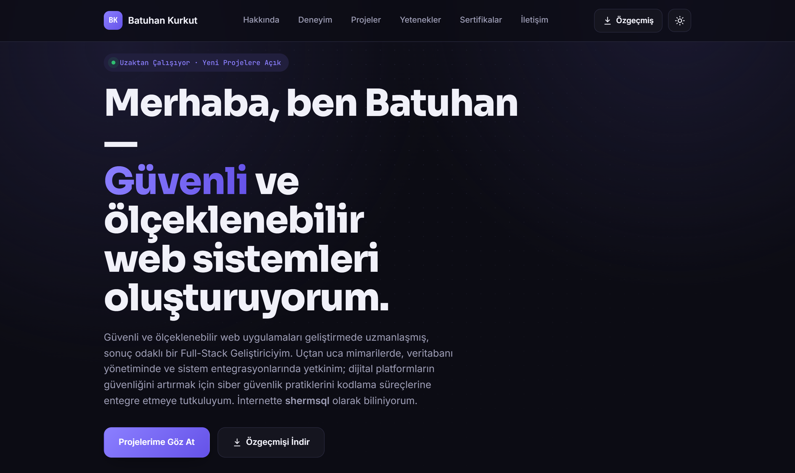

<p align="center">
  
</p>

### ✨ Portfolio

A light/dark themed portfolio site built with **Next.js 14 (App Router)**.

#### 🚀 Getting Started

```bash
npm install
npm run dev
```

Open `http://localhost:3000` in your browser.

#### 📁 Project Structure

- `app/` — layout, global styles, and the main page.
- `components/` — each section in its own folder (component + CSS Module): Navbar, Hero, About, Experience, Projects, Skills, EducationLanguages, Contact, Footer, ThemeToggle, ThemeProvider, RevealOnScroll.
- `data/content.ts` — **single source of truth for all site content**: experience, projects, skills, education, languages, social links. Update this file to change any content.
- `public/Resume/` — downloadable resume PDF.

#### 📄 Updating the Resume PDF

Replace the PDF in `public/Resume/` and update the `cvPath` / `cvFileName` fields in `data/content.ts` if needed. The "Download CV" button in both the navbar and hero section automatically points to this file.

#### 🌗 Theme

Light/dark mode is persisted via `localStorage`, with the system preference used as a fallback on first visit.

#### ☁️ Deployment

The project can be deployed on Vercel, Netlify, or any Node.js-capable server using:

```bash
npm run build && npm run start
```

#### 📜 License

MIT — see [LICENSE](./LICENSE.txt). Note: the license covers the **code only**; personal content (name, resume, bio, contact info in `data/content.ts` and `public/Resume/`) is not licensed for reuse.
